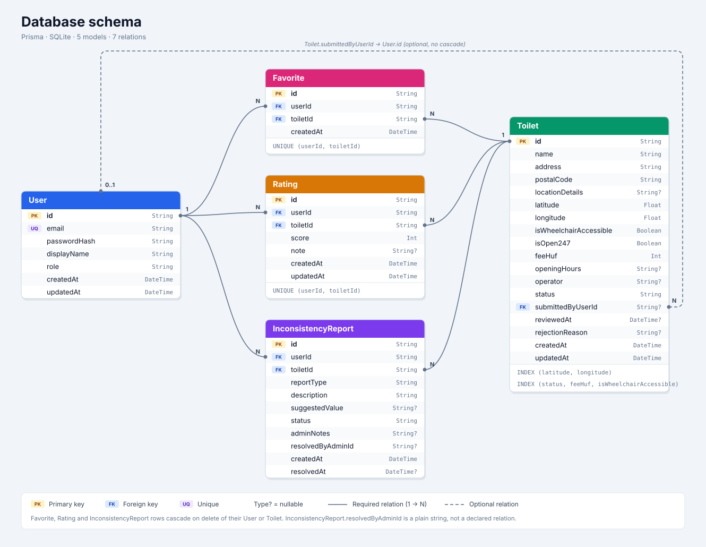

# Where2P Backend

NestJS backend for the Where2P public restroom locator application.

## Tech Stack

- NestJS
- Prisma ORM
- PostgreSQL
- JWT Authentication
- TypeScript

## Database Model

## Scripts

- `npm run start:dev` - Development server
- `npm run build` - Build
- `npm run test` - Unit tests
- `npm run test:e2e` - E2E tests
- `npm run prisma:seed` - Seed database
